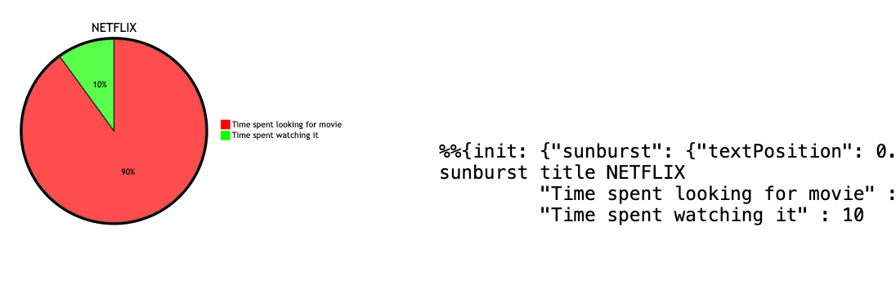

## Create `mermaid_view`, a webpage that will allow us to view our changes to mermaid ## 
- inside your local webserver (note that webstorm has the ability to serve html files with an
   ad-hoc server, so if webstorm is used, there's no need for a local webserver), make a directory,
   `mermaid_view` and create an html file (let's call it `index.html`) with the
    following content:
   ```html
      <pre class="mermaid" style="width:40vw; display: inline-block">
      %%{init: {"pie": {"textPosition": 0.5}, "themeVariables": {"pieOuterStrokeWidth": "5px", "pie1": "#ff0000", "pie2": "#00ff00"}} }%%
      pie title NETFLIX
      "Time spent looking for movie" : 90
      "Time spent watching it" : 10
      </pre>
      <pre class="mermaid" style="width: 40vw; display: inline-block">
      %%{init: {"sunburst": {"textPosition": 0.5}, "themeVariables": {"sunburstOuterStrokeWidth": "5px", "sunburst1": "#ff0000", "sunburst2": "#00ff00"}} }%%
      sunburst title NETFLIX
               "Time spent looking for movie" : 90
               "Time spent watching it" : 10
      </pre>
      <script type="module">
         import mermaid from 'https://cdn.jsdelivr.net/npm/mermaid@10/dist/mermaid.esm.min.mjs';
         mermaid.initialize({ startOnLoad: true, theme: "forest" });
      </script>
   ```
   Also note that while this file might work without a webserver, the changes that we'll make to it
   do require a server. When you view the served file in browser (`http://localhost/~username/mermaid_view/`)  
   you should see in the left half of the screen a pie chart, and in the right the
   text of the second `pre` element as-is. 
- The second `pre` has the same text as the first, except all
   occurrences of `pie` are replaced by `sunburst`. The purpose of the first stage of our work is to
   add to mermaid a diagram type called `sunburst` that behaves identically to `pie`.

## Create local clone, create an initial build and server it to `mermaid_view` ##

- fork `mermaid-js/mermaid` in your github account;
  reference: [fork-a-repo](https://docs.github.com/en/get-started/quickstart/fork-a-repo)
- make a directory on your local machine, let's call it `mermaid_work`
- clone inside that dir, your mermaid fork:
  ```sh
  git clone https://github.com/YOUR_GITHUB_NAME/mermaid.git
  ```
  It should create a directory `mermaid` inside your current directory (`mermaid_work`)
- change directory to the directory created by git clone (`mermaid`). 
- install (if not already installed) `pnpm` package manager; the recommended command was:
  curl -fsSL https://get.pnpm.io/install.sh | sh -
- run `pnpm install`; it should run without error, and it should create the directory
   `mermaid/packages/mermaid/dist` where, among others, there should be the file `mermaid.esm.min.mjs`
- now move to the view directory `mermaid_view` and create a sub-directory `chunks`, and then copy from
`dist` the file `mermaid.esm.min.mjs` as well as, recursively the contents of `chunks` sub-directory:
   ```shell
  mkdir chunks
  cp /mermaid_work/mermaid/packages/mermaid/dist/mermaid.esm.min.mjs .
  cp -R /mermaid_work/mermaid/packages/mermaid/dist/chunks ./chunks
   ```
  this assumes that `mermaid_work` directory is on root; make sure that you provide the correct 
   absolute or relative (from `mermaid_view`)
- you should now edit the `mermaid_view/view.html` and replace the line
  ```js
  import mermaid from 'https://cdn.jsdelivr.net/npm/mermaid@10/dist/mermaid.esm.min.mjs';
  ```
  with
  ```js
  import mermaid from '/mermaid.esm.min.mjs';
  ```
 - refreshing the `index.html` in browser, you should see no change; what we have done thus fas is 
    to build and serve mermaid library from our local clone. We are about to modify that clone in order
    to create the `sunburst` chart, initially identical to `pie`. 

## Create `sunburst`, a chart type identical (initially) to `pie` ##

### parser ###
- change directory to `mermaid_work`.
- run 
   ```shell
   mkdir mermaid/packages/parser/src/language/sunburst;
   cp mermaid/packages/parser/src/language/pie/* mermaid/packages/parser/src/language/sunburst;
   mv mermaid/packages/parser/src/language/sunburst/pie.langium mermaid/packages/parser/src/language/sunburst/sunburst.langium
   ```
- in `mermaid/packaghes/parser/langium-config.json`, smart duplicate all occurrences of `pie` to `sunburst`  
- in all the files of the `mermaid/packages/parser/src/language/sunburst/` directory,
  replace `pie` (case insensitive) with `sunburst` (preserve case),
- in `mermaid/packages/parser/src/language/index.ts` smart duplicate all occurrences of `pie` to `sunburst` (6)
- in `mermaid/packages/parser/src/parse.ts`: smart duplicate all occurrences of `pie` to `sunburst` 
- in `mermaid/packages/mermaid/src/schemas/config.schema.yaml`, smart duplicate all occurrences of `pie`
  to `sunburst`
- in `mermaid/.build/jsonSchema.ts`, smart duplicate all occurrences of `pie` to `sunburst`

### diagrams ###

- still in `mermaid_work`, run
   ```shell
  cp mermaid/packages/mermaid/src/diagrams/pie/* mermaid/packages/mermaid/src/diagrams/sunburst/;   
  for file in mermaid/packages/mermaid/src/diagrams/sunburst/pie* ; do mv "$file" "${file//pie/sunburst}" ; done
  ```
- the content of `mermaid/packages/mermaid/src/diagrams/sunburst/sunburstRenderer.ts` should be (it still uses `d3.pie`,
   so only some of the `pie` occurrences are to be replaced by `sunburst`):
  <pre style="max-height: 100px; overflow-y: scroll"><code>
   import type d3 from 'd3';
   import { scaleOrdinal, pie as d3sunburst, arc } from 'd3';
   import { log } from '../../logger.js';
   import { configureSvgSize } from '../../setupGraphViewbox.js';
   import { getConfig } from '../../diagram-api/diagramAPI.js';
   import { cleanAndMerge, parseFontSize } from '../../utils.js';
   import type { DrawDefinition, Group, SVG } from '../../diagram-api/types.js';
   import type { D3Section, SunburstDB, Sections } from './sunburstTypes.js';
   import type { MermaidConfig, SunburstDiagramConfig } from '../../config.type.js';
   import { selectSvgElement } from '../../rendering-util/selectSvgElement.js';
   
   const createSunburstArcs = (sections: Sections): d3.PieArcDatum<D3Section>[] => {
   // Compute the position of each group on the sunburst:
   const sunburstData: D3Section[] = [...sections.entries()]
   .map((element: [string, number]): D3Section => {
   return {
   label: element[0],
   value: element[1],
   };
   })
   .sort((a: D3Section, b: D3Section): number => {
   return b.value - a.value;
   });
   const sunburst: d3.Pie<unknown, D3Section> = d3sunburst<D3Section>().value(
   (d3Section: D3Section): number => d3Section.value
   );
   return sunburst(sunburstData);
   };
   
   /**
   * Draws a Pie Chart with the data given in text.
     *
     * @param text - sunburst chart code
     * @param id - diagram id
     * @param _version - MermaidJS version from package.json.
     * @param diagObj - A standard diagram containing the DB and the text and type etc of the diagram.
       */
       export const draw: DrawDefinition = (text, id, _version, diagObj) => {
       log.debug('rendering sunburst chart\n' + text);
       const db = diagObj.db as SunburstDB;
       const globalConfig: MermaidConfig = getConfig();
       const sunburstConfig: Required<SunburstDiagramConfig> = cleanAndMerge(db.getConfig(), globalConfig.sunburst);
       const MARGIN = 40;
       const LEGEND_RECT_SIZE = 18;
       const LEGEND_SPACING = 4;
       const height = 450;
       const sunburstWidth: number = height;
       const svg: SVG = selectSvgElement(id);
       const group: Group = svg.append('g');
       group.attr('transform', 'translate(' + sunburstWidth / 2 + ',' + height / 2 + ')');
   
   const { themeVariables } = globalConfig;
   let [outerStrokeWidth] = parseFontSize(themeVariables.sunburstOuterStrokeWidth);
   outerStrokeWidth ??= 2;
   
   const textPosition: number = sunburstConfig.textPosition;
   const radius: number = Math.min(sunburstWidth, height) / 2 - MARGIN;
   // Shape helper to build arcs:
   const arcGenerator: d3.Arc<unknown, d3.PieArcDatum<D3Section>> = arc<d3.PieArcDatum<D3Section>>()
   .innerRadius(0)
   .outerRadius(radius);
   const labelArcGenerator: d3.Arc<unknown, d3.PieArcDatum<D3Section>> = arc<
   d3.PieArcDatum<D3Section>
   >()
   .innerRadius(radius * textPosition)
   .outerRadius(radius * textPosition);
   
   group
   .append('circle')
   .attr('cx', 0)
   .attr('cy', 0)
   .attr('r', radius + outerStrokeWidth / 2)
   .attr('class', 'sunburstOuterCircle');
   
   const sections: Sections = db.getSections();
   const arcs: d3.PieArcDatum<D3Section>[] = createSunburstArcs(sections);
   
   const myGeneratedColors = [
   themeVariables.sunburst1,
   themeVariables.sunburst2,
   themeVariables.sunburst3,
   themeVariables.sunburst4,
   themeVariables.sunburst5,
   themeVariables.sunburst6,
   themeVariables.sunburst7,
   themeVariables.sunburst8,
   themeVariables.sunburst9,
   themeVariables.sunburst10,
   themeVariables.sunburst11,
   themeVariables.sunburst12,
   ];
   // Set the color scale
   const color: d3.ScaleOrdinal<string, 12, never> = scaleOrdinal(myGeneratedColors);
   
   // Build the sunburst chart: each part of the sunburst is a path that we build using the arc function.
   group
   .selectAll('mySlices')
   .data(arcs)
   .enter()
   .append('path')
   .attr('d', arcGenerator)
   .attr('fill', (datum: d3.PieArcDatum<D3Section>) => {
   return color(datum.data.label);
   })
   .attr('class', 'sunburstCircle');
   
   let sum = 0;
   sections.forEach((section) => {
   sum += section;
   });
   // Now add the percentage.
   // Use the centroid method to get the best coordinates.
   group
   .selectAll('mySlices')
   .data(arcs)
   .enter()
   .append('text')
   .text((datum: d3.PieArcDatum<D3Section>): string => {
   return ((datum.data.value / sum) * 100).toFixed(0) + '%';
   })
   .attr('transform', (datum: d3.PieArcDatum<D3Section>): string => {
   return 'translate(' + labelArcGenerator.centroid(datum) + ')';
   })
   .style('text-anchor', 'middle')
   .attr('class', 'slice');
   
   group
   .append('text')
   .text(db.getDiagramTitle())
   .attr('x', 0)
   .attr('y', -(height - 50) / 2)
   .attr('class', 'sunburstTitleText');
   
   // Add the legends/annotations for each section
   const legend = group
   .selectAll('.legend')
   .data(color.domain())
   .enter()
   .append('g')
   .attr('class', 'legend')
   .attr('transform', (_datum, index: number): string => {
   const height = LEGEND_RECT_SIZE + LEGEND_SPACING;
   const offset = (height * color.domain().length) / 2;
   const horizontal = 12 * LEGEND_RECT_SIZE;
   const vertical = index * height - offset;
   return 'translate(' + horizontal + ',' + vertical + ')';
   });
   
   legend
   .append('rect')
   .attr('width', LEGEND_RECT_SIZE)
   .attr('height', LEGEND_RECT_SIZE)
   .style('fill', color)
   .style('stroke', color);
   
   legend
   .data(arcs)
   .append('text')
   .attr('x', LEGEND_RECT_SIZE + LEGEND_SPACING)
   .attr('y', LEGEND_RECT_SIZE - LEGEND_SPACING)
   .text((datum: d3.PieArcDatum<D3Section>): string => {
   const { label, value } = datum.data;
   if (db.getShowData()) {
   return `${label} [${value}]`;
   }
   return label;
   });
   
   const longestTextWidth = Math.max(
   ...legend
   .selectAll('text')
   .nodes()
   .map((node) => (node as Element)?.getBoundingClientRect().width ?? 0)
   );
   
   const totalWidth = sunburstWidth + MARGIN + LEGEND_RECT_SIZE + LEGEND_SPACING + longestTextWidth;
   
   // Set viewBox
   svg.attr('viewBox', `0 0 ${totalWidth} ${height}`);
   configureSvgSize(svg, height, totalWidth, sunburstConfig.useMaxWidth);
   };
   
   export const renderer = { draw };
  </code></pre></div>
- in the file `mermaid/packages/mermaid/src/config.type.ts`, smart duplicate all occurrences of `pie` to `sunburst`
- for all the other files in `mermaid/packages/mermaid/src/diagrams/sunburst/`, replace `pie` (case insensitive) with
   `sunburst` (preserve case)
- in `mermaid/packages/mermaid/src/diagram-api/diagram-orchestration.spec.ts` and
  `mermaid/packages/mermaid/src/diagram-api/diagram-orchestration.ts`, smart duplicate all occurrences
  of `pie` to `sunburst`

### others ###
- run
   ```shell
   cp mermaid/packages/mermaid/src/docs/syntax/pie.md mermaid/packages/mermaid/src/docs/syntax/sunburst.md;
   cp mermaid/packages/parser/tests/pie.test.ts mermaid/packages/parser/tests/sunburst.test.ts
   ```
- in `mermaid/packages/mermaid/src/docs/syntax/sunburst.md` replace `pie` (case insensitive) with
  `sunburst` (preserve case)
- in `mermaid/packages/parser/tests/sunburst.test.ts`: replace `pie` (case insensitive) with `sunburst`
  (preserve case).
- in `mermaid/packages/parser/tests/test-util.ts`: smart duplicate all occurrences of `pie` to `sunburst`

### verify ###

- from `mermaid_work`.
- go back to directory to `mermaid_work`.
- copy the newly generated mermaid build:
   ```shell
   cp /mermaid_work/mermaid/packages/mermaid/dist/mermaid.esm.min.mjs .;
  cp -R /mermaid_work/mermaid/packages/mermaid/dist/chunks/* ./chunks
   ```

cp ../../../work/mermaid/sunburst03/mermaid/packages/mermaid/dist/mermaid.esm.min.mjs .;
cp -R ../../../work/mermaid/sunburst03/mermaid/packages/mermaid/dist/chunks/* ./chunks
